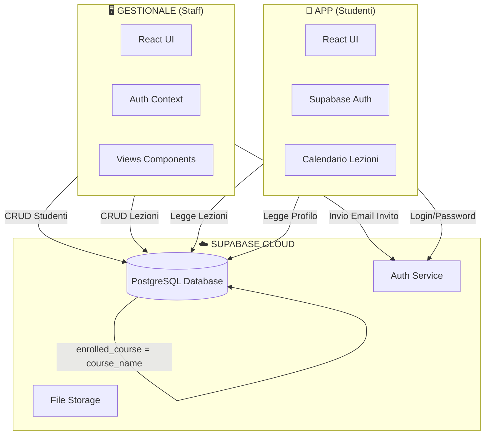
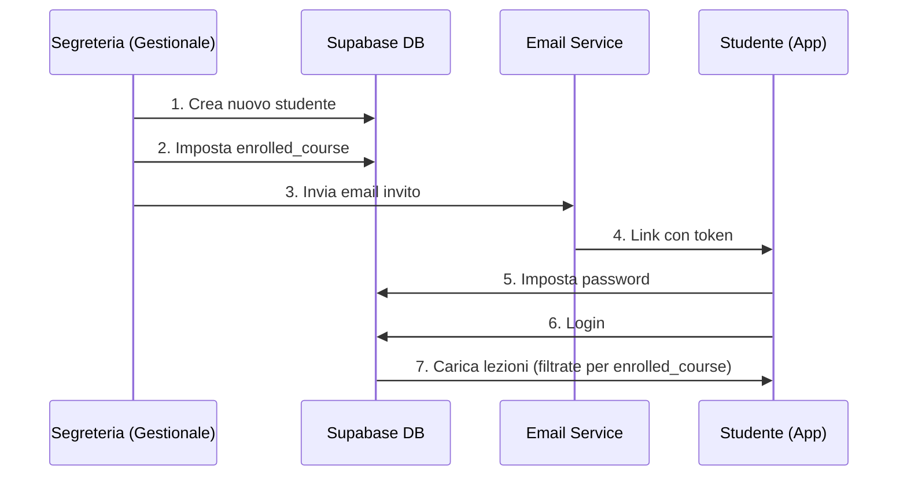
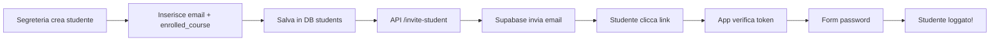

# 🎵 NAM Maestro - Sistema di Gestione Scuola di Musica

## 📋 Panoramica del Sistema

NAM Maestro è un sistema completo per la gestione di una scuola di musica, composto da due applicazioni interconnesse:

| Progetto | Tipo | Utenti Target | Framework |
|----------|------|---------------|-----------|
| **GESTIONALE** | Web App Desktop | Staff (Direzione, Segreteria) | React + TypeScript + Vite |
| **APP** | PWA Mobile | Studenti | React + JavaScript + Vite |

---

## 🏗️ Architettura del Sistema



---

## 🔄 Flusso dei Dati



---

## 📁 Struttura dei Progetti

### GESTIONALE (`/Volumes/HD_01/NEURORA/GESTIONALE`)

```
src/
├── components/
│   ├── CalendarView.tsx      # Calendario con drag&drop + AI Scheduler
│   ├── DidacticsView.tsx     # Gestione corsi e piani studi
│   ├── StudentsView.tsx      # CRUD studenti + invio inviti
│   ├── CrmView.tsx           # Gestione lead
│   ├── Sidebar.tsx           # Menu navigazione (filtrato per ruolo)
│   ├── Header.tsx            # Barra superiore + switch ruoli
│   └── AuthLogin.tsx         # Schermata login staff
├── contexts/
│   └── AuthContext.tsx       # Gestione sessione Supabase
├── lib/
│   └── supabaseClient.ts     # Configurazione Supabase
├── types.ts                  # Tipi TypeScript (Role, View, Student, etc.)
├── constants.ts              # Liste corsi, docenti, aule
└── App.tsx                   # Entry point + routing basato su ruoli
```

### APP (`/Volumes/HD_01/NEURORA/APP/maestro-app`)

```
src/
├── App.jsx                   # App principale (login, dashboard, calendario)
├── supabaseClient.js         # Configurazione Supabase
├── firebase.js               # Push notifications (FCM)
└── components/
    └── UpdatePrompt.jsx      # Prompt aggiornamento PWA
```

---

## 🔐 Sistema di Autenticazione

### Flusso Nuovo Studente



### Autenticazione Staff (Gestionale)
- Login con email/password via Supabase Auth
- Sessione persistente con `AuthContext`
- Ruoli: `direzione` (vede tutto) | `segreteria` (vista limitata)

### Autenticazione Studenti (App)
- Riceve email di invito con token
- Imposta password al primo accesso
- Login successivi con email/password

---

## 📊 Tabelle Supabase

### `students`
| Campo | Tipo | Descrizione |
|-------|------|-------------|
| `id` | UUID | Primary key |
| `email` | text | Email studente |
| `first_name`, `last_name` | text | Nome e cognome |
| `enrolled_course` | text | **CHIAVE**: Corso di iscrizione effettivo |
| `auth_user_id` | UUID | Link a Supabase Auth |
| `notification_token` | text | Token FCM per push |

### `lessons`
| Campo | Tipo | Descrizione |
|-------|------|-------------|
| `id` | UUID | Primary key |
| `course_name` | text | **CHIAVE**: Matching con enrolled_course |
| `title` | text | Nome materia |
| `teacher_name` | text | Docente |
| `lesson_date` | date | Data lezione (YYYY-MM-DD) |
| `start_time`, `end_time` | time | Orari |
| `room` | text | Aula |
| `zoom_link` | text | Link per lezioni online |

### Logica di Collegamento

```sql
-- Studente vede solo le lezioni del suo corso
SELECT * FROM lessons 
WHERE course_name = (
    SELECT enrolled_course FROM students 
    WHERE auth_user_id = current_user()
)
```

---

## 🎨 Tecnologie Utilizzate

| Tecnologia | Uso |
|------------|-----|
| **React 18** | UI Framework |
| **TypeScript** | Tipizzazione (solo Gestionale) |
| **Vite** | Build tool + Dev server |
| **Tailwind CSS** | Styling utility-first |
| **Supabase** | Backend-as-a-Service (DB, Auth, Storage) |
| **Firebase FCM** | Push notifications (App) |

---

## 🚀 Comandi di Sviluppo

```bash
# GESTIONALE
cd /Volumes/HD_01/NEURORA/GESTIONALE
npm install
npm run dev          # http://localhost:3000

# APP
cd /Volumes/HD_01/NEURORA/APP/maestro-app
npm install
npm run dev          # http://localhost:5173
```

---

## 👥 Sistema Ruoli (Gestionale)

| Ruolo | Accesso Menu |
|-------|--------------|
| **Direzione** | Dashboard, CRM, Didattica, Segreteria, Amministrazione, Magazzino, Reportistica |
| **Segreteria** | Dashboard, Didattica, Segreteria |

---

## 📱 Funzionalità App Studente

- 🏠 **Dashboard** - Prossime lezioni, notifiche, scadenze
- 📅 **Calendario** - Vista mensile con lezioni
- 📋 **Presenze** - Monitoraggio assenze
- 📄 **Documenti** - Dispense e materiale didattico
- ⚙️ **Impostazioni** - Modifica profilo e avatar

---

## 🔧 Variabili d'Ambiente

### `.env` (Gestionale)
```
VITE_SUPABASE_URL=https://xxx.supabase.co
VITE_SUPABASE_ANON_KEY=xxx
```

### `.env` (App)
```
VITE_SUPABASE_URL=https://xxx.supabase.co
VITE_SUPABASE_ANON_KEY=xxx
VITE_FIREBASE_API_KEY=xxx
VITE_FIREBASE_PROJECT_ID=xxx
```

---

## 📝 Note Importanti

1. **Timezone**: La funzione `filterLessonsForDate` nell'App usa date locali (non UTC) per evitare shift di giorno
2. **enrolled_course**: È il campo chiave che collega studenti a lezioni
3. **PWA**: L'App è installabile come Progressive Web App su iOS/Android
4. **AI Scheduler**: Il Gestionale ha un assistente AI per la programmazione automatica delle lezioni

---

## 📖 Come Funziona il Sistema - Descrizione Completa

### Il Concetto Base

NAM Maestro è stato progettato come un ecosistema digitale completo per gestire tutte le operazioni di una scuola di musica moderna. Il sistema si basa su un'architettura a due applicazioni separate ma interconnesse, che condividono lo stesso database cloud su Supabase.

Il **Gestionale** è l'applicazione utilizzata dallo staff della scuola (direzione e segreteria) per gestire studenti, lezioni, lead commerciali e tutte le operazioni amministrative. È una web application desktop-first, costruita con React e TypeScript, ottimizzata per essere utilizzata su computer con schermi grandi.

L'**App** è invece una Progressive Web App (PWA) pensata per gli studenti, accessibile da smartphone o tablet. Consente loro di visualizzare il proprio calendario delle lezioni, controllare le presenze, scaricare materiale didattico e ricevere notifiche push.

### Come Interagiscono le Due Applicazioni

La comunicazione tra Gestionale e App avviene attraverso **Supabase**, una piattaforma cloud che fornisce database PostgreSQL, autenticazione, storage per file e API automatiche.

Quando un operatore della segreteria inserisce un nuovo studente nel Gestionale, i dati vengono salvati nella tabella `students` su Supabase. Il campo più importante è `enrolled_course`, che specifica il corso effettivo a cui lo studente si è iscritto (ad esempio "Fonico Anno Unico Anno 1" o "Batteria Pro Anno 2").

Parallelamente, la segreteria o la direzione programma le lezioni attraverso il calendario del Gestionale. Ogni lezione viene salvata nella tabella `lessons` con un campo `course_name` che indica a quale corso appartiene quella lezione.

**La magia avviene qui**: quando uno studente apre l'App e accede al calendario, il sistema filtra automaticamente le lezioni mostrando SOLO quelle il cui `course_name` corrisponde al proprio `enrolled_course`. Uno studente iscritto a "Batteria Pro Anno 1" vedrà quindi solo le lezioni di quel corso, non quelle degli altri corsi.

### Il Flusso di Iscrizione di un Nuovo Studente

Immaginiamo di seguire il percorso di Mario, un nuovo studente che si iscrive al corso di Fonico:

1. **Primo contatto**: Mario contatta la scuola interessato al corso Fonico. La segreteria lo inserisce nel CRM come lead.

2. **Iscrizione**: Dopo il colloquio e l'audizione, Mario decide di iscriversi. La segreteria apre la sezione "Segreteria & Iscritti", clicca su "Nuovo Iscritto" e compila tutti i campi: anagrafica, contatti, e soprattutto seleziona nel campo "Corso di Iscrizione (Effettivo)" il valore "Fonico Anno Unico Anno 1".

3. **Invito automatico**: Al salvataggio, il sistema invia automaticamente un'email all'indirizzo di Mario con un link speciale. Questa email contiene un token di invito generato da Supabase Auth.

4. **Primo accesso**: Mario clicca sul link nell'email e viene portato all'App. Qui imposta la sua password personale. Da questo momento ha un account attivo.

5. **Accesso quotidiano**: Mario può ora aprire l'App, fare login con email e password, e vedere immediatamente la propria dashboard. Nel calendario vedrà tutte le lezioni del corso "Fonico Anno Unico Anno 1" programmate dalla scuola.

### La Programmazione delle Lezioni

Dal lato Gestionale, la direzione o la segreteria didattica utilizza il calendario per programmare le lezioni. Ci sono due modalità:

**Inserimento Manuale**: Si clicca su "Manuale", si seleziona il corso principale (es. "Fonico Anno Unico"), poi la materia specifica (es. "Informatica AU" o "Pro Tools AU"), il docente, l'aula, la data e gli orari. La lezione viene salvata su Supabase e appare immediatamente nel calendario.

**AI Scheduler**: Per programmazioni più complesse o ricorrenti, è disponibile un assistente AI. Si può scrivere una richiesta in linguaggio naturale come "Programma 10 lezioni di Pro Tools con il prof. Rossi in Aula Digital ogni lunedì dalle 14 alle 16 a partire dal 3 febbraio" e l'assistente genererà automaticamente tutti gli eventi.

### Il Sistema dei Ruoli

Non tutti gli operatori hanno gli stessi permessi. Il sistema distingue tra:

**Direzione**: Ha accesso completo a tutte le sezioni. Può vedere e modificare lead nel CRM, gestire studenti, programmare lezioni, accedere all'amministrazione, al magazzino e alla reportistica.

**Segreteria**: Ha una vista limitata. Può accedere solo al calendario, alla didattica e alla gestione degli iscritti. Non vede il CRM, l'amministrazione, il magazzino o i report finanziari.

Quando un utente cambia il ruolo selezionato in alto a destra dell'interfaccia, il menu laterale si aggiorna automaticamente mostrando solo le voci accessibili per quel ruolo.

### Le Notifiche Push

L'App è integrata con Firebase Cloud Messaging (FCM) per inviare notifiche push agli studenti. Quando uno studente installa l'App sul proprio dispositivo e accetta le notifiche, un token univoco viene salvato nel suo profilo su Supabase.

La scuola può quindi inviare notifiche per comunicare variazioni di orario, annunci importanti, promemoria per scadenze di pagamento o qualsiasi altra comunicazione urgente.

### La Progressive Web App

L'App studente è costruita come PWA, il che significa che può essere "installata" sul telefono come se fosse un'app nativa. Su iOS appare con l'icona nella home screen e si apre a schermo intero senza barra del browser. Su Android funziona in modo analogo.

Questo approccio permette di avere un'esperienza simile a un'app nativa senza dover pubblicare su App Store o Google Play, con aggiornamenti immediati e nessun processo di review.

### La Sincronizzazione in Tempo Reale

Grazie all'architettura cloud-based, tutte le modifiche sono sincronizzate in tempo reale. Se la segreteria aggiunge una nuova lezione al calendario, questa appare immediatamente nell'App di tutti gli studenti iscritti a quel corso. Non è necessario nessun refresh manuale o sincronizzazione.

### Considerazioni Tecniche

Entrambe le applicazioni utilizzano React come framework UI, con la differenza che il Gestionale usa TypeScript per una maggiore sicurezza sui tipi, mentre l'App usa JavaScript puro per semplicità.

Vite è il build tool scelto per entrambi i progetti, garantendo tempi di avvio velocissimi in sviluppo e build ottimizzate per la produzione.

Tailwind CSS fornisce lo styling, permettendo uno sviluppo rapido e consistente dell'interfaccia grafica attraverso classi utility.

Supabase, infine, elimina la necessità di gestire un backend custom, fornendo out-of-the-box database, autenticazione, storage e API REST/GraphQL.

---

*Documentazione aggiornata: 25 Gennaio 2026*
